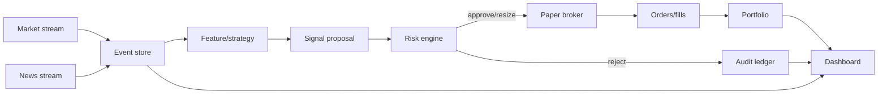

# Architecture

## Design goals

1. Paper execution only by default.
2. Deterministic risk controls always sit between a model and a broker.
3. Every external fact keeps both event time and knowledge time.
4. Every proposal, veto, order, and fill is explainable and replayable.
5. Providers are adapters, not dependencies of the core domain.
6. Missing or stale information fails closed.

## Runtime flow

## Backend modules

- `domain.py`: typed API and domain records
- `providers.py`: demo and Alpaca market/news streams
- `strategy.py`: explainable vertical-slice signal generator
- `risk.py`: non-bypassable controls and kill switch
- `broker.py`: conservative internal simulator and Alpaca paper adapter
- `portfolio.py`: cash, positions, equity, exposure, and drawdown
- `store.py`: event ledger and WebSocket fan-out
- `engine.py`: orchestration only; no hidden trading policy
- `main.py`: HTTP/WebSocket interface and lifecycle

## Data integrity

Every market or news observation has:

- `event_time`: when the provider says it happened
- `knowledge_time`: when this system received it

Historical training must join on knowledge time. Joining on corrected publication timestamps would introduce look-ahead leakage.

## Production persistence

Replace `EventStore` with PostgreSQL/TimescaleDB using append-only records for:

- quotes and bars
- news/article versions and extracted events
- feature snapshots
- model predictions
- proposals and risk decisions
- orders and fills
- portfolio snapshots
- operational and data-quality events

Raw provider payloads should be written to object storage before normalization.

## Model boundary

A production model should implement the `Strategy` protocol or feed a dedicated signal service. General-purpose LLMs may extract structured events and produce explanations, but must never invoke broker code.

## Security boundary

The dashboard control API requires authentication before internet deployment. Secrets belong in a secret manager, not `.env` in production. The Alpaca adapter deliberately points at `paper-api.alpaca.markets`; live execution is not implemented.
