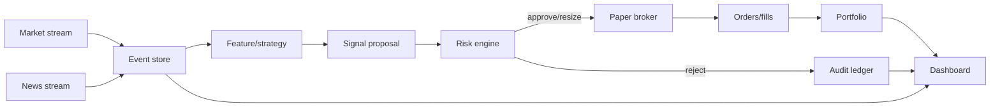

# Architecture

## Design goals

1. Paper execution only by default.
2. Deterministic risk controls always sit between a model and a broker.
3. Every external fact keeps both event time and knowledge time.
4. Every proposal, veto, order, and fill is explainable and replayable.
5. Providers are adapters, not dependencies of the core domain.
6. Missing or stale information fails closed.

## Runtime flow

## Backend modules

- `domain.py`: typed API and domain records
- `providers.py`: demo and Alpaca market/news streams
- `strategy.py`: explainable vertical-slice signal generator
- `risk.py`: non-bypassable controls and kill switch
- `broker.py`: conservative internal simulator and Alpaca paper adapter
- `portfolio.py`: signed quantities, direction-aware average entry and P&L,
  cash, margin, exposure, financing, and drawdown
- `borrow.py`: fail-closed borrow status and forced-cover/recall abstractions
- `cost_model.py`: versioned execution, financing, funding/FX, and tax assumptions
- `tax.py`: separate estimated Polish tax reporting; never a per-fill deduction
- `store.py`: event ledger and WebSocket fan-out
- `engine.py`: orchestration only; no hidden trading policy
- `main.py`: HTTP/WebSocket interface and lifecycle

## Data integrity

Every market or news observation has:

- `event_time`: when the provider says it happened
- `knowledge_time`: when this system received it

Historical training must join on knowledge time. Joining on corrected publication timestamps would introduce look-ahead leakage.

## Production persistence

Replace `EventStore` with PostgreSQL/TimescaleDB using append-only records for:

- quotes and bars
- news/article versions and extracted events
- feature snapshots
- model predictions
- proposals and risk decisions
- orders and fills
- portfolio snapshots
- operational and data-quality events

Raw provider payloads should be written to object storage before normalization.

## Model boundary

A production model should implement the `Strategy` protocol or feed a dedicated signal service. General-purpose LLMs may extract structured events and produce explanations, but must never invoke broker code.

## Security boundary

The dashboard control API requires authentication before internet deployment. Secrets belong in a secret manager, not `.env` in production. The Alpaca adapter deliberately points at `paper-api.alpaca.markets`; live execution is not implemented.

## Signed position and borrow boundary

Orders carry a position effect derived from current signed inventory. Sells can
reduce or close a long, open or increase a short, or reverse long to short. Buys
can increase a long, cover a short, or reverse short to long. A reversal realizes
PnL on the closed quantity and starts the new direction at the fill price.

Short-sale cash proceeds are credited to cash while the negative marked market
value remains in equity. Gross long, gross short, net exposure, initial buying
power, maintenance margin excess, and direction-specific realized/unrealized PnL
are exposed in portfolio snapshots.

The risk engine asks for borrow only for the notional that would open or increase
a short. Missing, hard-to-borrow, unavailable, recalled, or insufficient status
rejects the whole proposal. The configured ETB list is deterministic paper input;
it is not a claim about live availability. Recall handling produces an explicit
forced-cover instruction which remains inside the paper broker path.

## Cost and tax boundary

The paper fill ledger separates observed spread and slippage embedded in the
fill price from commissions, regulatory sell fees, and market-impact stress
booked as explicit cash costs. Borrow, margin interest, and dividend replacement
accrue as financing costs. Each experiment freezes the complete versioned cost
manifest and its SHA-256 in registry and holdout metadata.

PLN→USD conversion belongs to funding. It is charged only when an operator
records a conversion cash flow, never automatically on trade turnover. Strategy
performance remains pre-tax after execution and financing costs. Polish tax is
a separate estimated report with a separate after-tax summary; it does not alter
fills or the pre-tax equity curve and is not tax advice.
